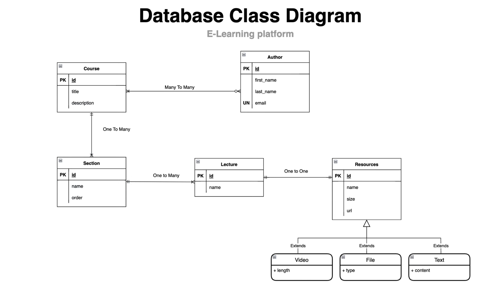

# Spring Data JPA - E-learning Platform Backend

This project serves as the backend for an e-learning platform and is associated with the comprehensive [Spring Data JPA course](https://www.youtube.com/watch?v=mcl_nibV39s&ab_channel=BoualiAli) led by instructor Ali Bouali. The project demonstrates how to implement various Spring Data JPA functionalities in a real-world application.

## Project Overview

This backend application provides a robust and scalable infrastructure for managing users, courses, enrollments, and other entities within an e-learning platform. It leverages **Spring Boot** and **Spring Data JPA** to manage data persistence, while also following best practices for building maintainable and extensible Java applications.

### Key Features
- User management (registration, authentication)
- Course management (create, update, delete)
- Enrollment system
- RESTful APIs for handling platform data
- Integration with PostgreSQL using Docker containers
- Database initialization using JPA's `create-drop` strategy

## Course Reference

This project is related to Ali Bouali's in-depth [Spring Data JPA Course](https://www.youtube.com/watch?v=mcl_nibV39s&ab_channel=BoualiAli). The course provides step-by-step guidance on how to use Spring Data JPA in Java applications, making it easier for developers to implement database-driven functionality with Spring Boot.

## Database Diagram

The following database diagram illustrates the relationships between various entities in the system, such as users, courses, and enrollments.



## Technologies Used
- **Java**: The core language of the project.
- **Spring Boot**: Simplifies the creation of production-ready applications.
- **Spring Data JPA**: Provides a seamless integration with JPA, allowing for robust database interactions.
- **PostgreSQL**: The relational database used for this project.
- **Docker**: Containerizes the PostgreSQL database for easy management and scalability.

## Setup and Installation

### Prerequisites
Before you begin, ensure you have the following tools installed:
- Java 17 or higher
- Maven 3.6+ for building the project
- Docker for running PostgreSQL in a container

### Step-by-Step Instructions

1. **Clone the repository:**
   ```bash
   git clone https://github.com/CAPELLAX02/spring-data-jpa-bouali.git

2. **Build the project using Maven:**
   ```bash
   mvn clean install

3. **Run PostgreSQL with Docker:**
   ```bash
   docker run --name my_postgres -e POSTGRES_PASSWORD=123456 -d -p 5433:5432 postgres

4. **Run the Spring Boot application:**
   ```bash
   mvn spring-boot:run

5. **Access the application:**
   - The APIs will be accessible at `http://localhost:8080`.
   - PostgreSQL will run at `localhost:5433`.

## Contributing

Feel free to submit issues or pull requests for improvements. Contributions are always welcome!

